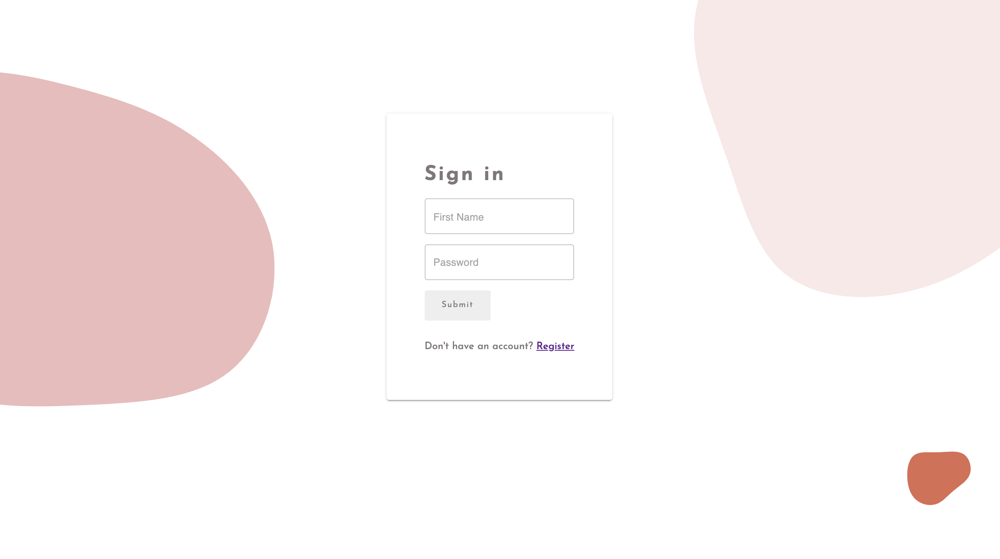
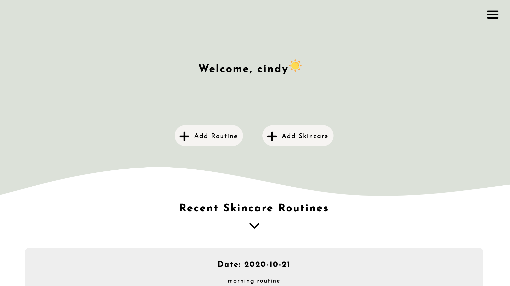
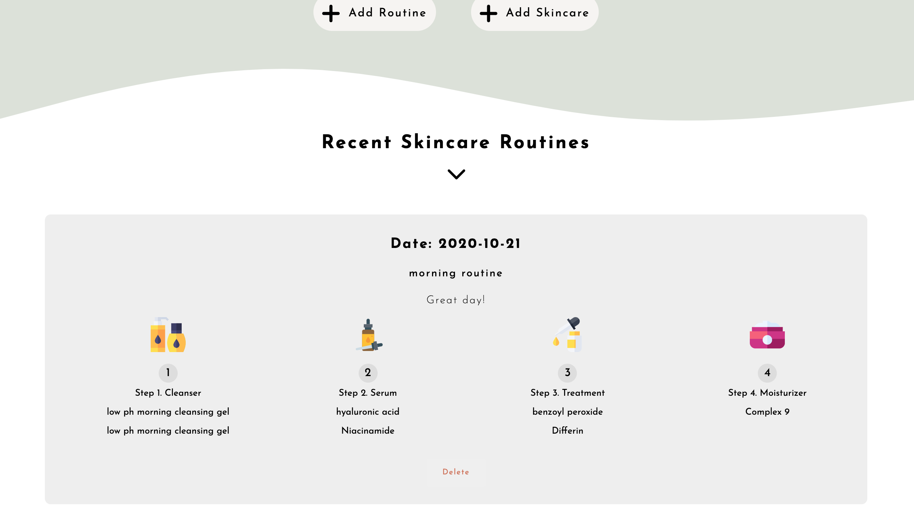
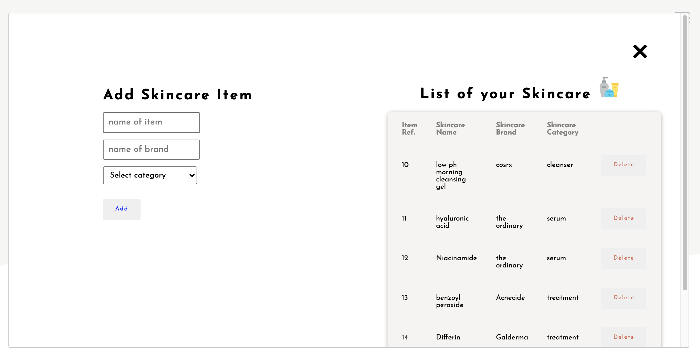
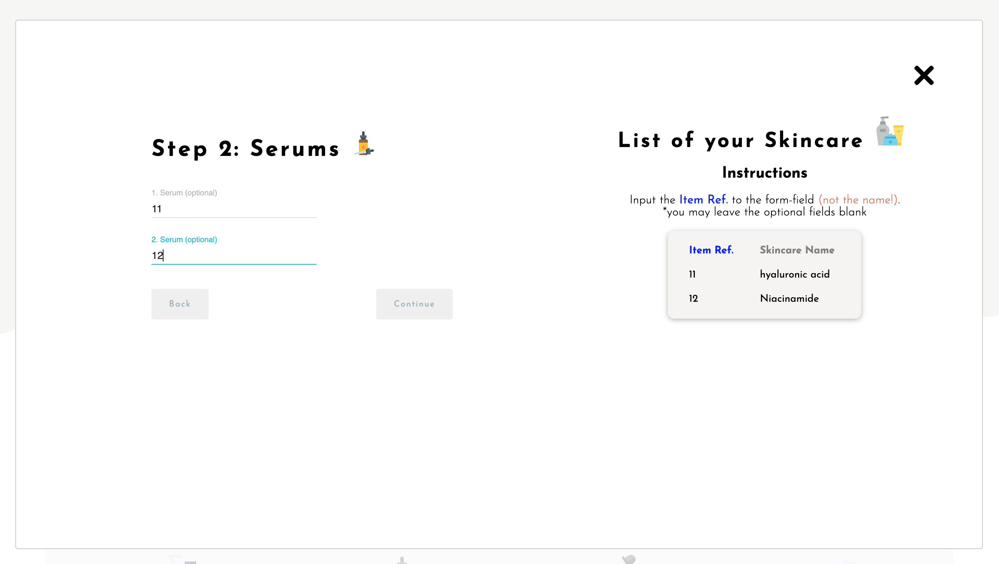
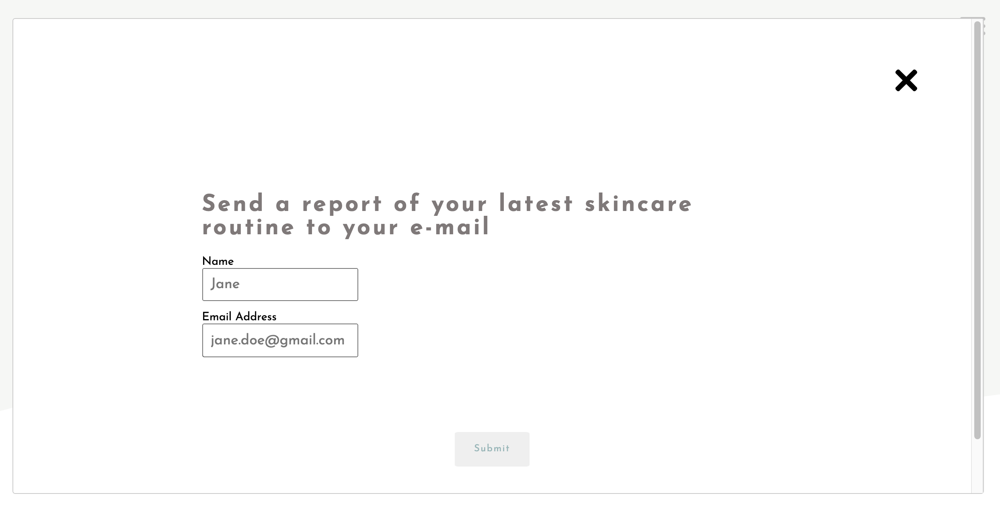
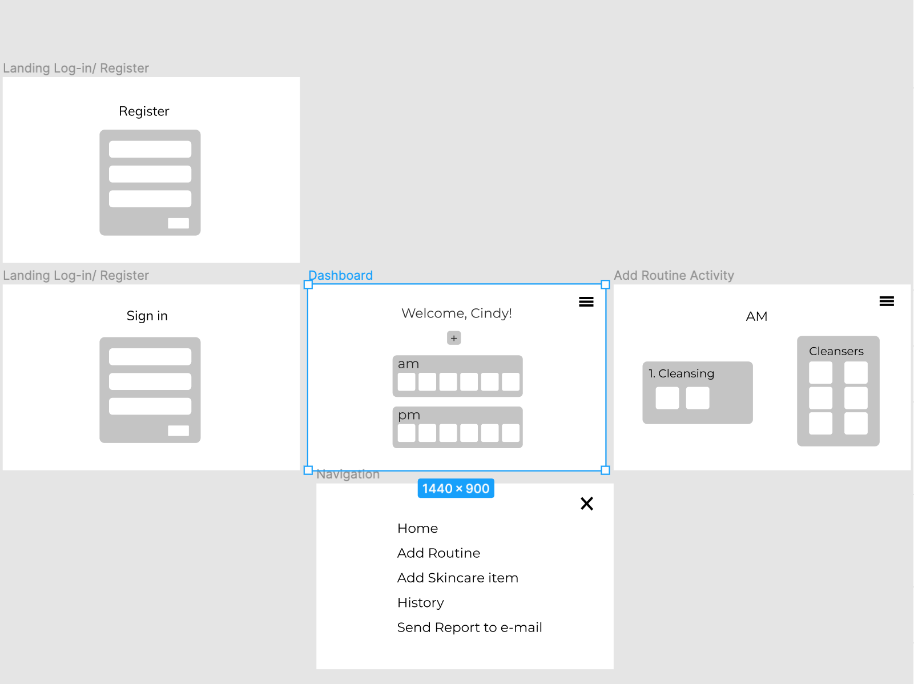
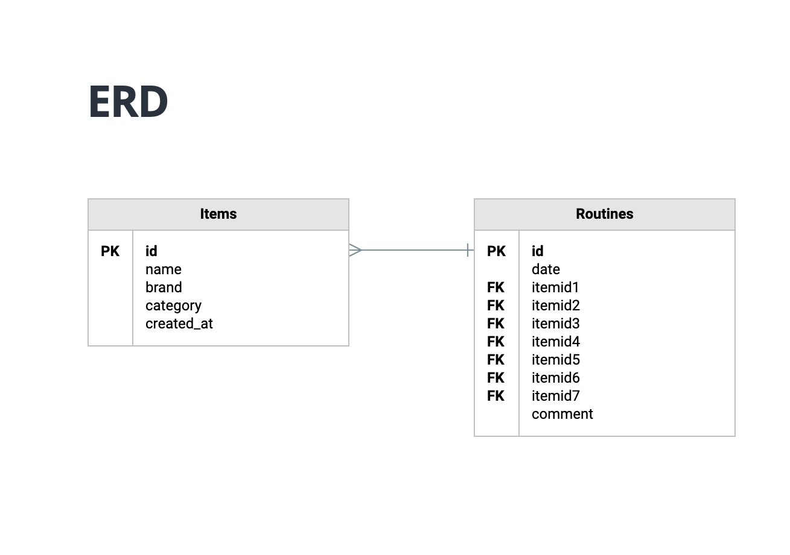
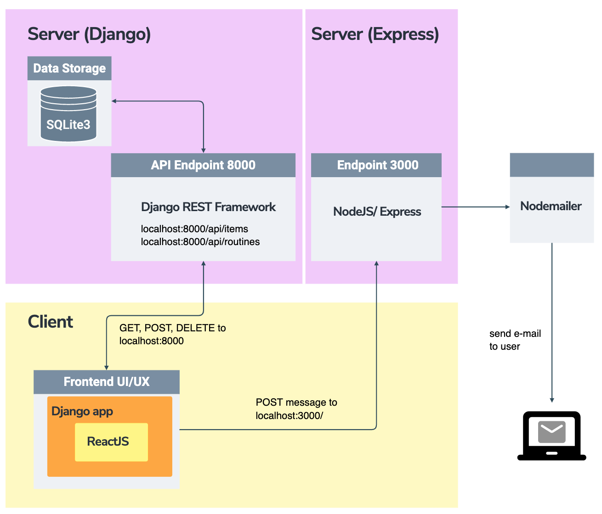
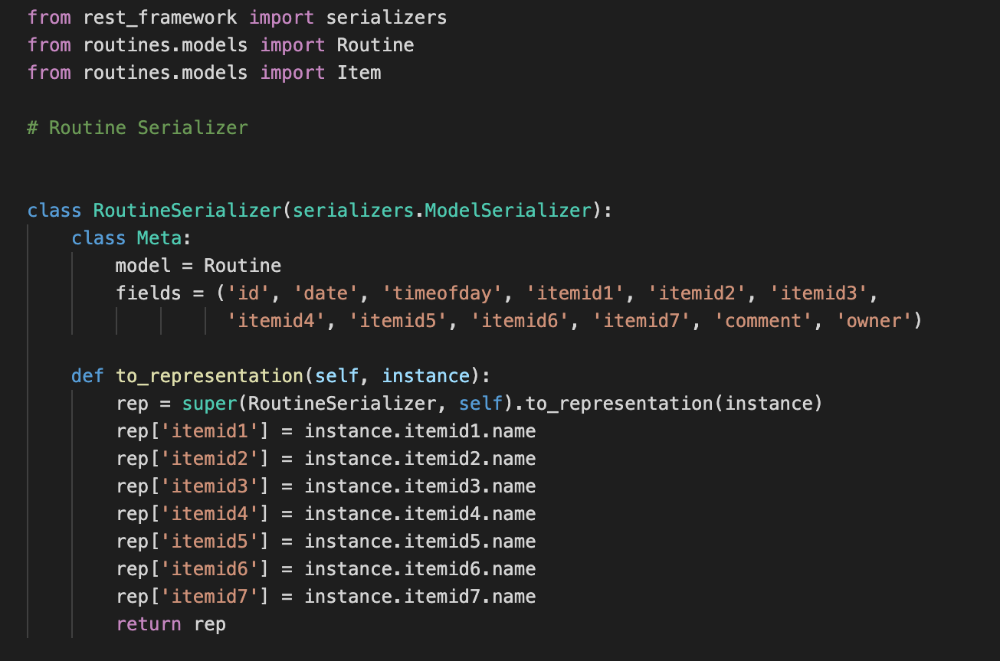

## <pre>

---

# care - A Skincare Diary & Planner 🌿

---

Link: http://cindyfengw.pythonanywhere.com

## Description

This app allows users to create their own library of skincare products which they can use in planning and logging their daily skincare routines. The user can also send reports of their daily skincare routine from the app to their email address.

## Purpose

The purpose of the app was to let users track and plan their skincare routines. Being someone who use several skincare treatments to treat different skin concerns, the combination of different treatments can sometimes be too harsh on my skin. With this app, the user can input the products they frequently use in their skincare routine to plan and log their morning/evening routines, and keep a track on what products they have been using recently and decide if it is time to pause/ continue the use of a product.

## How to use:

1. Register and Sign in with your name and password.

   

2. On the dashboard page you can 1. add your routine, 2. add a skincare product, 3. view your routines, 4. send e-reports of your routines to your e-mail

   

3. The list of skincare routines will display the products you used in your routines

   

4. Add and delete skincare products to your skincare products library

   

5. Create your skincare routine. The list on the right will show you the skincare products from your skincare products library suitable for each step.

   

6. Send an e-report of your latest skincare routine to your email address

## Instructions

- Fork and Clone
- Install dependencies (1): `pip install -r requirements.txt`
- Install dependencies (2): `npm install`
- terminal 1: Start up API `pipenv shell` > `cd routineapp` > `python manage.py runserver`
- terminal 2: Run Webpack `pipenv shell` > `cd routineapp` > `npm run dev`
- terminal 3: Start up server for the e-mail feature `pipenv shell` > `cd routineapp` > `cd frontend` > `cd src` > `cd components` > `node server.js`
- visit http://localhost:8000/

## Technologies used:

- **Django**
- **ReactJS**
- **Redux**
- **Database: SQLite3**
- HTML/CSS
- **Creation of API: Django REST Framework**
- **Token-based Authentication: Django Knox**
- **Webpack** (module bundling)
- Babel
- [NodeMailer](https://github.com/nodemailer/nodemailer) (creation of e-mail functionality)
- Postman (API testing)
- NodeJS
- Express (side back-end server for e-mail)
- **Deployment: PythonAnywhere**
- **Planning/Wireframing: Figma**

### Other frameworks & libraries:

- Material UI
- React Bootstrap
- Animate.CSS
- [React Alert](https://www.npmjs.com/package/react-alert)
- [React Modal](https://www.npmjs.com/package/react-modal)

## Planning

### Wireframes

The first step of planning the App was creating the wireframes for the App using Figma. The main features I wanted to implement were:

1. a **_multi-step form_** for creating the skincare routines.
2. **_react modals_** instead of individual routes for different pages/components

### Database

Below is a representation of the two objects that make up the Django model.

The first object 1. **_Items_** make up the collection of skincare items the user inputs to their library.

The second object 2. **_Routines_** make up the collection of skincare routines with the chosen items (ForeignKeys from the Item object) for each step in the routine (cleansing, serum, treatment and moisturizing).

### Structure

The application uses a Django RESTful API with a React front-end. The React is in its own "frontend" Django app. Within the "frontend" Django app is a NodeJS/Express app which implement the Nodemailer module to send reports to the user's email address.

## Challenges & Solutions

1. Displaying ForeignKey in different Format. The Django model was made up of two objects 1. Item and 2. Routines. The "Routine" object had ForeignKeys itemid1-7 from the "Item" object. **_When rendering the ForeignKey value on the front-end, the value would show up as the id of the item instance rather than the name of the item instance._**

**_Solution_**: **_To solve this, I used a to_representation method that overrides the RelatedField,_** to customize the relational field. Which resulted in rendering the name instead of the id on the front-end.

2. Posting a modified message to the user, with Nodemailer.

**_Solution_**: In order to post data from the Django back-end to the NodeJS/Express endpoint, I stringified the fetched "routine" object from the backend. I attempted to modify the fetched object to customize it and make it more readable, however due to that the stringified object was sent to the express server endpoint as a default value in a form, the functions that would modify the object would not run before the POST request was made, hence reading the modified object as "undefined". **_I was only able to overcome it by adding some optional arguments to the stringify method, which made it slightly more readable._**

## Future Features

1. Send customized e-mails. Currently, the E-mail function posts a stringified JSON object to Nodemailer that in turn creates the email sent to the user. The stringified object is currently the raw version of the routine object. I would like to find a solution that would allow me sending modified objects so that the reports become more readable and customized.

2. Include charts and counters to give more detailed information about the frequency and duration of the use of the skincare products in the user's library.

</pre>
