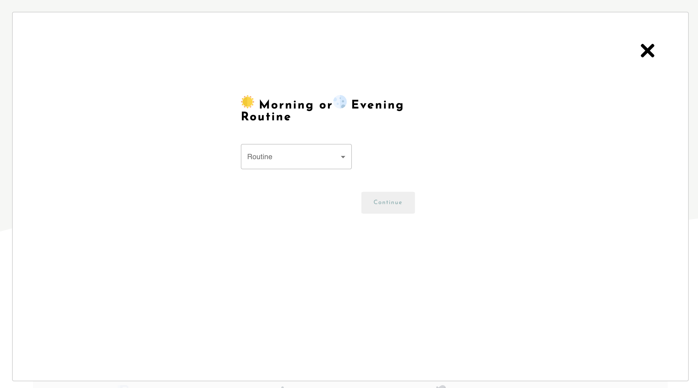
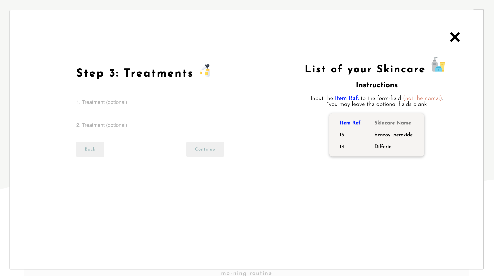

---
# CARE - A Skincare Routine Diary & Planner 🌿
---

Link: http://cindyfengw.pythonanywhere.com

## Description

This app allow users to create their own library of skincare products which they can use in planning and logging their daily skincare routines. The user can also send reports of their daily skincare routine from the app to their email address.

## The purpose

## How to use:

## Instructions

- Fork and Clone
- Install dependencies (1): `pip install -r requirements.txt`
- Install dependencies (2): `npm install`
- terminal 1: Start up API `pipenv shell` > `cd routineapp` > `python manage.py runserver`
- terminal 2: Run Webpack `pipenv shell` > `cd routineapp` > `npm run dev`
- terminal 3: Start up server for the e-mail feature `pipenv shell` > `cd routineapp` > `cd frontend` > `cd src` > `cd components` > `node server.js`
- visit http://localhost:8000/

## Technologies used:

## Planning

## Challenges & Solutions

## Future Features
